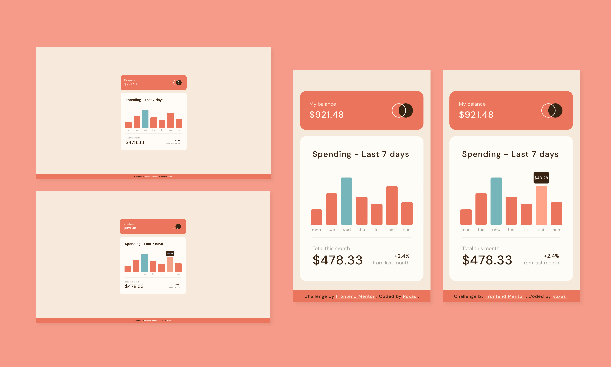
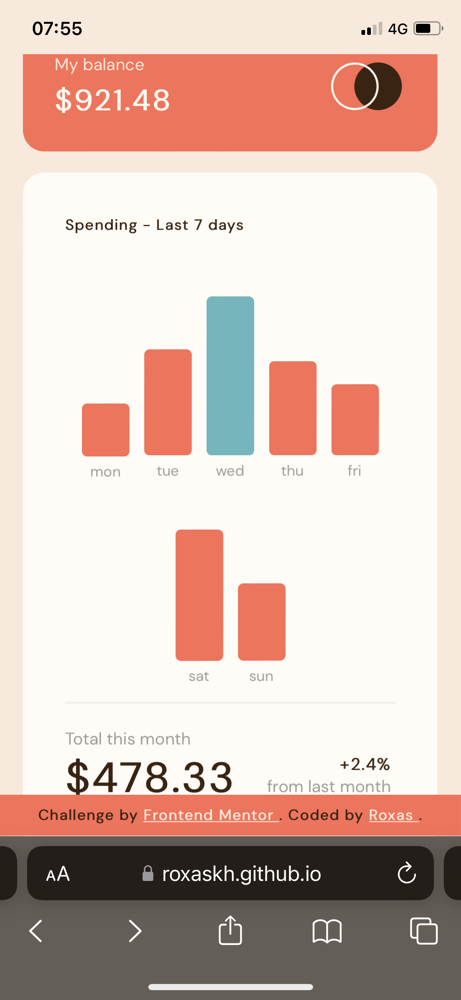
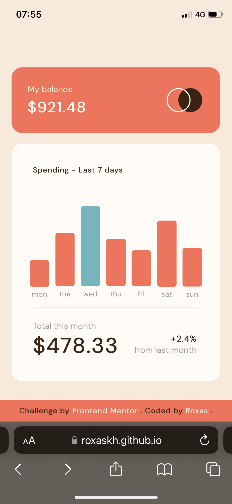

# Frontend Mentor - Expenses chart component


This is a solution to the [Expenses chart component challenge on Frontend Mentor](https://www.frontendmentor.io/challenges/expenses-chart-component-e7yJBUdjwt).

## Table of contents

- [Overview](#overview)
  - [The challenge](#the-challenge)
  - [Screenshot](#screenshot)
  - [Links](#links)
- [My process](#my-process)
  - [Built with](#built-with)
  - [Some insights](#some-insights)
  - [Dear Safari, why](#dear-safari-why)
  - [Useful resources](#useful-resources)
  - [Known issues](#known-issues)

## Overview

### The challenge

Users should be able to:

- View the bar chart and hover over the individual bars to see the correct amounts for each day (tap on mobile)
- See the current day’s bar highlighted in a different colour to the other bars
- View the optimal layout for the content depending on their device’s screen size
- **Bonus**: Use the JSON data file provided to dynamically size the bars on the chart

### Screenshot



### Links

You can check my solution here: [https://roxaskh.github.io/Expenses-Chart-Component/](https://roxaskh.github.io/Expenses-Chart-Component/)

## My process

### Built with

- HTML5
- CSS3 (& Flexbox)
- JavaScript

### Some insights

The container div is centered using the top and left CSS properties set on 50% and CSS transformations to center it properly.

The hover part was the most difficult part to implement, as it technically would have needed to alter a CSS property of an element while hovering on an element that was consequent in the DOM structure of the page.
This isn't possible tho as there's no native previous sibling selector in CSS.
That said, there is instead an [adjacent sibling combinator](https://developer.mozilla.org/en-US/docs/Web/CSS/Adjacent_sibling_combinator) (which acts as a next sibling selector), so the opposite was possible to implement through it.

After doing some research, i found [an interesting approach](https://stackoverflow.com/questions/4502633/how-to-affect-other-elements-when-one-element-is-hovered/32470900#32470900): exploiting [Flexbox](https://developer.mozilla.org/en-US/docs/Web/CSS/CSS_Flexible_Box_Layout/Basic_Concepts_of_Flexbox) functionalities you could actually display things in a reversed order.
So, what i did was inverting the order of the elements in the HTML structure, displaying them reversed using Flexbox

```sh
display: inline-flex; /* this specifies the elements are displayed as flex elements; the inline logic works the same as for blocks */
flex-direction: column-reverse; /* this specifies the elements have to be displayed in column and in a reversed order */
justify-content: flex-start; /* this specifies that items are packed toward the start of the flex-direction */
align-items: center; /* this defines how flex items are laid out along the cross axis, and so centered */
```

to have the graph the right way, and finally i could use the next sibling selector to implement the hover as the design defined.

_Note: this could have probably been handled also through JS and the use of mouseover and mouseout event listeners, but i found the CSS Flexbox solution to be cleaner and more interesting._


As for the bars of the graph, they are dinamically sized, both in width and height:
- for the width, they're sized according to the width of the graph div container, and the function which does that is also linked to a resize event listener attached to the window itself, so that everytime the window gets resized the right width is recalculated
- for their heights instead, they're calculated in proportion to the max height of a bar, which is set to be 150px; as i'm using Flexbox the heights are set through the flex-basis property.

The number of bars is also dinamically generated based on the entries of the JSON file (even if in this particular scenario you'd likely not have more than 7 days), so that any JSON data file in the right format can be used.

Everything of this dinamic sizing is managed through JS, in an async function which uses the [Fetch API](https://developer.mozilla.org/en-US/docs/Web/API/Fetch_API/Using_Fetch) function to get the JSON data as an array of objects.

The bar having the max amount is also differently coloured through JS.

### Dear Safari, why

As an iPhone user myself, compatibility with Safari needed more than one fix to get things which worked smoothly on other browsers not to be buggy, as apparently Safari likes to be different.

First of all, as the :hover pseudostate didn't work properly on mobile as usual, i had to add the :active one as well consequently to make it work on tap on mobile. This is possible because [as the MDN states for the active pseudostate](https://developer.mozilla.org/en-US/docs/Web/CSS/%3Aactive):

  _Styles defined by the :active pseudo-class will be overridden by any subsequent link-related pseudo-class (:link, :hover, or :visited) that has at least equal specificity. To style links appropriately, put the :active rule after all other link-related rules, as defined by the LVHA-order: :link — :visited — :hover — :active._

This didn't work on Safari anyway. Apparently the [Apple DOCS](https://developer.apple.com/library/archive/documentation/AppleApplications/Reference/SafariWebContent/AdjustingtheTextSize/AdjustingtheTextSize.html) state that _"on iOS, mouse events are sent so quickly that the down or active state is never received"._

So i had to add an empty touchstart event listener to the body of the page through JS to explicitly telling the browser to react to touch events, and to remove the default grey translucent tap–highlight colour Mobile Safari applies using the following CSS rule:

```sh
html {
    -webkit-tap-highlight-color: rgba(0,0,0,0);
}
```

_Note: adding an empty touchstart event listener on the body of a page can break other functionalities, but this was not the case for this simple graph. Be cautious when using this solution_

The bars of the graph are highlighted on hover (and on tap) through [CSS filters](https://developer.mozilla.org/en-US/docs/Web/CSS/filter) brightness and grayscale.
It seems to be that these filters are buggy on Safari (i had a weird flashing happening), and the solution is to add these 3 CSS rules to the elements on which the filters are applied.

```sh
-webkit-transform: translateZ(0);
-webkit-perspective: 1000;
-webkit-backface-visibility: hidden;
```

_Althought this solution is present on multiple StackOverflow posts, and does work, i found no explanation whatsoever on these topic on how and why it works (other than a guy saying the first rule make filters rendering through the gpu and so faster). If you do know the reasons behind it, feel free to tell me so that i can update this readme._

Last but not least the footer font-size was bigger than it should have been on Safari (even if it was right on the firefox emulation of an iphone in the inspector), so i had to add some [custom CSS rules to the media queries](https://stackoverflow.com/questions/62874933/media-query-for-safari-browser) to make it more little only on Safari.

### Useful resources

- [A complete guide to flexbox](https://css-tricks.com/snippets/css/a-guide-to-flexbox/) - This helped me immensely understanding how Flexbox works and all of his properties. I highly suggest it more than any other official resource if you're learning it for the first time.

### Known issues

The website page is most likely to load broken on first load (with no caching) on Safari. After a reload everything gets fine.
I've seen it happening on Chromium-bowsers as well at the early stages, but now it shouldn't happen anymore on Chrome and derivatives.

I think there's some problems in the loading of the JS script file, but i really don't what's causing them. As forcing a double reload would be immensely dumb, right now i'm leaving it like this.

If you have any idea on how to fix this problem, feel free to contact me or open an issue about it.

Here below you can see some examples of broken loads:

Bars on two lines               |  Spending text too little
--------------------------------|--------------------------------
  |  